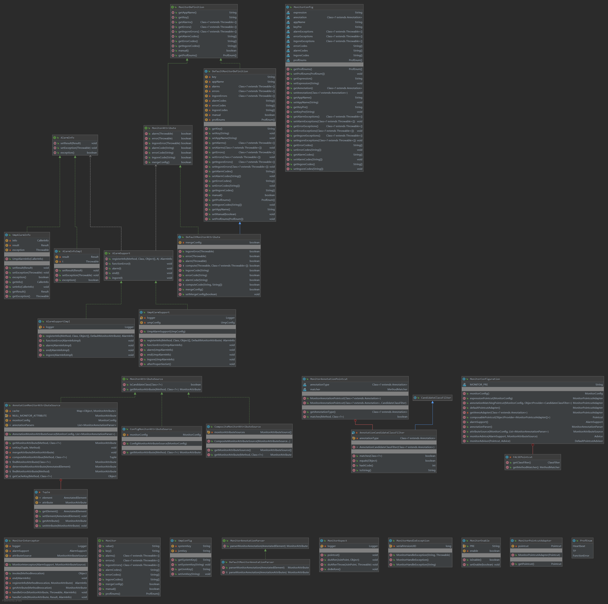

<h2 id = "title">监控切面</h2>
1. 动机  
    + 监控对于业务代码的侵入比较严重，为了使业务与非业务功能最大程度解耦，所以抽象出有关监控的切面，使之能够配置化，定制化。
2. 使用
    ```
        monitor.switch.enable=true
        monitor.app-name=hahahah
        monitor.annotation=com.wjq.monitor.annotation.Monitor
        monitor.alarmExceptions=java.lang.RuntimeException,java.lang.Exception
        monitor.ingore-codes=100,100
        monitor.expression=execution(* com.wjq.monitor.execute.**.*(..))
    ```
    + 通过 Aspectj 切面表达式 + 注解 的方式匹配切点，就像事务那样，可以单独通过表达式或注解或两者结合的方式，来提高使用的灵活性
    + 提供全局配置类 MonitorConfig，作为兜底的报警配置
    + 提供默认注解 [Monitor](#Monitor)，该注解可以在方法或类上使用，如果加载类上则表明该类中所有方法都会进行监控记录
    + 不支持非public或 static，final 修饰的方法
3. 扩展
    1. 可以使用自己定义的 枚举类，这样可以兼容原来做的一些报警切面
    2. 如果自定义的枚举类与 [Monitor](#Monitor) 中的属性定义不一致，需要自己扩展注解解析器[MonitorAnnotationParser](#MonitorAnnotationParser)
    3. 可以在 [MonitorDefinition](#MonitorDefinition) 扩展属性，eg:添加心跳属性
    4. 自定义监控匹配规则，eg:对code进行正则匹配, 扩展接口 [AlarmSupport](#AlarmSupport) 实现，在该实现中，可以对上一条中新增的属性做处理  
4. 实现
    + 该组件是在spring环境中使用的，在实现的过程使用了spring提供的能力，Aspectj表达式解析，注解解析，AOP，springBoot自动组装等
    + 对于报警规则的匹配，通过异常或返回code，来过滤是否需要报警或记录可用率，对于code获取，抽象出统一的接口 [Result](#Result)
    + pointcut,advice,advisor
    + 实现MethodeInterceptor，对匹配到的方法进行监控记录，包括返回值，异常情况的判断
    + 实现注解 pointcut，对配置相应注解类，方法进行匹配，
    
5. 备注  
    **对于自己扩展的类，除属性相关类以外都需要在spring context 中自主注册**




*<div id = "AlarmSupport">[AlarmSupport](#title)</div>*
```java

public interface AlarmSupport<I extends AlarmInfo,A extends MonitorAttribute> {

    /**
     * 获取报警信息组成信息,
     * 有异常自己内部处理不要抛出来
     * 如果返回空则不记录信息
     * @param method 当前执行方法
     * @param targetClass 该方法所属的类
     *
     * @return
     */
    AlarmInfo registerInfo(Method method, Class targetClass,Object[] arguments,  A attribute);

    /**
     * 记录可用率
     * @param info 可用率信息
     */
    void functionError(I info);

    /**
     * 报警
     * @param info 报警信息
     */
    void alarm(I info);

    /**
     * 结束记录
     * @param info
     */
    void end(I info);

    /**
     * 忽略情况
     * @param alarmInfo
     */
    void ingore(I alarmInfo);

}
```

*<div id = "MonitorAnnotationParser">[MonitorAnnotationParser](#title)</div>*
```java
/**
 * 从类或方法注解上转换出监控属性
 * @author wangjianqiang24
 * @date 2020/6/1
 *
 * @see DefaultMonitorAnnotationParser
 */
public interface MonitorAnnotationParser {

    /**
     * 转换监控属性 从 给定的类或方法上
     * 返回 {@code null} 如果方法/类 上没找到相应的注解
     * @param element
     * @return 监控属性 或 {@code null}
     */
    MonitorAttribute parserMonitorAnnotation(AnnotatedElement element);

}

```


*<div id = "MonitorDefinition">[MonitorDefinition](#title)</div>*
```java
/**
*
*
**/
public interface MonitorDefinition {

    /**
     * 获取应用名字
     * @return
     */
    String getAppName();


    /**
     * 获取唯一标识
     * @return
     */
    String getKey();


    /**
     * 报警异常
     * @return
     */
    Class<? extends Throwable>[] getAlarms();

    /**
     * 异常记录
     * @return
     */
    Class<? extends Throwable>[] getErrors();

    /**
     * 忽略异常
     * @return
     */
    Class<? extends Throwable>[] getIngoreErrors();

    /**
     * 报警code
     *
     * @return
     */
    String[] getAlarmCodes();

    /**
     * 记录异常code
     * @return
     */
    String[] getErrorCodes();

    /**
     * 忽略异常code
     * @return
     */
    String[] getIngoreCodes();

       /**
     * 是否手动监控
     * 如果设为 true 则该切面不做任何记录，将直接调用方法
     * @return
     */
    boolean manual();

    /**
     * 监控类型
     * @return
     */
    ProfEnum[] getProfEnums();
}
```

*<div id = "Result">[Result](#title)</div>*
```java
    public interface Result {
       /**
        * 执行结果code
        * @return
        */
       String getCode();

       /**
        * 执行结果描述
        * @return
        */
       String getInfo();
    }
```

*<div id = "Monitor">[Monitor](#title)</div>*
``` java
@Inherited
@Retention(RetentionPolicy.RUNTIME)
@Target({ElementType.METHOD,ElementType.TYPE})
public @interface Monitor {

    @AliasFor("key")
    String value() default "";

    /**
     *
     * 唯一标识
     *
     * 如果key是从类上的注解中取得并且不为空，则认为该key为每个方法key的前缀，在进行组装时会 {@code key + "." + method.name()}
     * 如果key是从方法注解上取得并且不为空，则可以直接使用
     * 如果该注解中的key为空
     *    1. 如果 {@link MonitorConfig#getKeyPre()} 不为空,则 {@code key = String.join(".", monitorConfig.getKeyPre(), method.getDeclaringClass().getSimpleName(), method.getName())}
     *    2. 否则 {@code key = String.join(".", method.getDeclaringClass().getName(), method.getName())}
     * @return
     */
    @AliasFor("value")
    String key() default "";

    /**
     * 报警异常
     * 配置覆盖规则参考 {@link Monitor#errors()}
     * @see MonitorConfig#getAlarmExceptions()
     *
     * @return
     */
    Class<? extends Throwable>[] alarms() default {};

    /**
     * 记录可用率异常,
     * 如果该配置不为空则直接使用该配置信息过滤；
     * 如果该配置为空，查看 {@link Monitor#mergeConfig()}
     *  1. {@link MonitorConfig#getErrorExceptions()} 也为空，则默认对所有异常记录
     *  2. {@link MonitorConfig#getErrorExceptions()} 不为空，则使用 {@code MonitorConfig} 中配置
     * @return
     */
    Class<? extends Throwable>[] errors() default {};

    /**
     * 忽略记录,配置覆盖规则参考 {@link Monitor#errors()}
     * @see MonitorConfig#getIngoreExceptions()
     *
     *
     * @return
     */
    Class<? extends Throwable>[] ingoreErrors() default {};


    /**
     * 报警code，配置覆盖规则参考 {@link Monitor#errors()}
     *
     * @see MonitorConfig#getAlarmCodes()
     * @return
     */
    String[] alarmCodes() default {};

    /**
     * 记录可用率code，配置覆盖规则参考 {@link Monitor#errors()}
     * @see MonitorConfig#getErrorCodes()
     * @return
     */
    String[] errorCodes() default {};

    /**
     * 忽略code，配置覆盖规则参考 {@link Monitor#errors()}
     *
     * @see MonitorConfig#getIngoreCodes()
     *
     * @return
     */
    String[] ingoreCodes() default {};

    /**
     * 是否与公共配置的配置进行合并
     * 如果注解中的值为空列表或空字符串且公共配置部位空{@code str == null || str.equals("")}
     * 前提是 {@link com.wjq.monitor.domain.MonitorConfig} 中的配置不为空
     * 配置为 {@code true} 进行合并
     * false 跳过不处理
     *
     * @return
     */
    boolean mergeConfig() default true;

     /**
     * 是否手动监控
     * 如果设为 true 则该切面不做任何记录，将直接调用方法
     *
     * @return
     */
    boolean manual() default false;

    /**
     * 监控类型
     * @return
     */
    ProfEnum[] profEnums() default {ProfEnum.FunctionError,ProfEnum.TP};

}

```

*<div id = "MonitorConfig">[MonitorConfig](#title)</div>*
```java

public class MonitorConfig {


    /**
     * 表达式
     */
    private String expression;


    /**
     * 注解类,
     * 会对该注解所修饰的类做aop代理
     */
    private Class<? extends Annotation> annotation;


    /**
     * 应用名
     */
    private String appName;

    /**
     * 主键前缀，针对每个方法会有一个key
     * 在组成key是会用到前缀
     * @see Monitor#key()
     */
    private String keyPre;


    /**
     * 报警异常
     */
    private Class<? extends Throwable>[] alarmExceptions;

    /**
     * 错误记录异常
     */
    private Class<? extends Throwable>[] errorExceptions;

    /**
     * 忽略异常
     */
    private Class<? extends Throwable>[] ingoreExceptions;

    /**
     * 错误code
     */
    private String[] errorCodes;

    /**
     * 报警code
     */
    private String[] alarmCodes;

    /**
     * 忽略code
     * 成功或幂等
     */
    private String[] ingoreCodes;

    /**
     * 监控类型
     */
    private ProfEnum[] profEnums = {ProfEnum.TP,ProfEnum.FunctionError};
}
```
